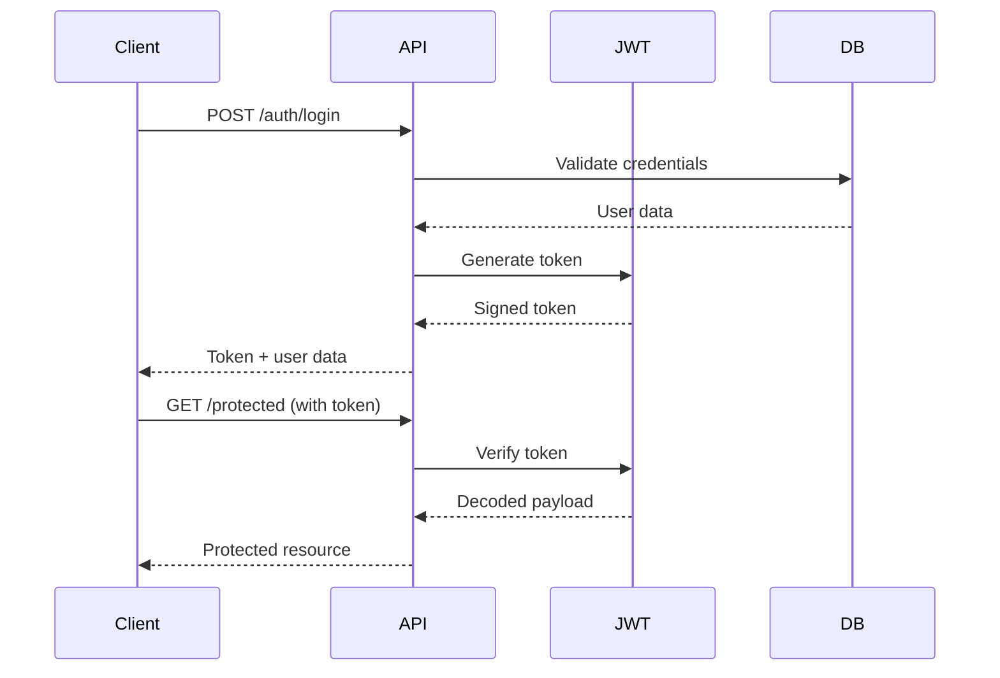

# Enterprise-Grade Express.js Backend

> **Built by Avnish Kumar** - A production-ready, scalable Express.js backend architecture following industry best practices.

[](https://nodejs.org/)
[](https://expressjs.com/)
[](https://mongoosejs.com/)
[](LICENSE)

## About This Project

This is my carefully crafted Express.js backend architecture that I've developed to solve real-world scalability and maintainability challenges. After working with various backend patterns, I've settled on this **Service Layer Pattern** combined with **MVC architecture** as it provides the perfect balance between structure and flexibility.

### My Goals Behind This Architecture

- **Separation of Concerns**: Each layer has a single responsibility
- **Testability**: Easy to unit test business logic and API endpoints
- **Maintainability**: Clear structure that any developer can understand
- **Scalability**: Ready to handle growth from MVP to enterprise-level
- **Code Reusability**: DRY principles applied throughout

---

## Architecture Deep Dive

I've designed this backend following the **Layered Architecture** pattern with clear boundaries:

```
Request Flow
├── Routes Layer (HTTP Entry Points)
├── Controller Layer (Request/Response Handling)
├── Service Layer (Business Logic)
├── Repository Layer (Data Access)
└── Model Layer (Data Structure)
```

### Directory Structure & My Reasoning

| Directory           | Purpose                         | Why I Chose This                                         |
| ------------------- | ------------------------------- | -------------------------------------------------------- |
| `src/config/`       | Environment & app configuration | Centralized config management for different environments |
| `src/constants/`    | Application constants           | Eliminates magic numbers and strings across codebase     |
| `src/controllers/`  | HTTP request handlers           | Thin layer focused only on HTTP concerns                 |
| `src/dtos/`         | Data Transfer Objects           | Input validation and data transformation                 |
| `src/loaders/`      | Application initializers        | Clean separation of startup concerns                     |
| `src/middlewares/`  | Cross-cutting concerns          | Reusable logic for auth, logging, error handling         |
| `src/models/`       | Database schemas                | Single source of truth for data structure                |
| `src/repositories/` | Data access layer               | Abstraction over database operations                     |
| `src/routes/`       | Route definitions               | Centralized routing with proper organization             |
| `src/services/`     | Business logic                  | Core application logic isolated from framework           |
| `src/utils/`        | Helper functions                | Common utilities used across the application             |

### Core Design Principles I Follow

1. **Single Responsibility Principle**: Each file/class has one reason to change
2. **Dependency**: Services receive their dependencies, making testing easier
3. **Error First**: Comprehensive error handling at every layer
4. **Security First**: Built-in security middlewares and practices
5. **Performance Optimized**: Compression, rate limiting, and efficient queries

---

## Quick Start Guide

### Prerequisites

- **Node.js**: v18.0.0 or higher
- **npm**: v8.0.0 or higher
- **MongoDB**: Local instance or MongoDB Atlas account

### Installation

```bash
# Clone the repository
git clone <your-repo-url>
cd express-backend

# Install dependencies
npm install

# Set up environment variables
cp .env.example .env
# Edit .env with your configuration
```

### Environment Setup

Create a `.env` file in the root directory:

```env
# Server Configuration
PORT=3000
NODE_ENV=development

# Database
MONGODB_URI=mongodb://localhost:27017/your-database-name

# JWT Configuration
JWT_SECRET=your-super-secret-jwt-key
JWT_EXPIRES_IN=7d

# Rate Limiting
RATE_LIMIT_WINDOW_MS=900000
RATE_LIMIT_MAX_REQUESTS=100
```

---

## Available Scripts & My Workflow

I've set up these scripts to streamline my development process:

### Development Mode

```bash
npm run dev
```

**My daily driver command!**

- Uses **nodemon** for hot-reloading
- Automatically restarts on file changes
- Perfect for rapid development cycles
- Includes detailed error logging

### Production Mode

```bash
npm start
```

**For production deployments:**

- Runs with `node` (no auto-restart)
- Optimized for performance
- Production-level error handling
- Memory efficient

### Code Quality Tools

```bash
# Check code style and potential issues
npm run lint

# Auto-fix linting issues
npm run lint:fix

# Check code formatting
npm run format

# Auto-format entire codebase
npm run format:fix
```

**Why I'm strict about code quality:**

- Consistent code style across team members
- Catches potential bugs early
- Makes code reviews more focused on logic
- Maintains professional code standards

### Testing

```bash
npm test
```

**My testing approach:**

- **Unit tests** for services and utilities
- **Integration tests** for API endpoints
- **Jest** as the testing framework
- **Supertest** for HTTP assertions

### Git Hooks Setup

```bash
npm run prepare
```

**Sets up Husky for:**

- Pre-commit linting and formatting
- Pre-push testing
- Ensures no broken code reaches repository
- Maintains code quality standards automatically

---

## Tech Stack & Dependencies

### Core Framework

- **Express.js 5.1.0**: Latest version with improved performance
- **Node.js**: ES6+ modules with modern JavaScript features

### Database & ODM

- **MongoDB**: NoSQL database for flexibility
- **Mongoose 8.18.1**: Elegant MongoDB object modeling

### Security & Authentication

- **Helmet**: Security headers middleware
- **CORS**: Cross-origin resource sharing
- **Rate Limiting**: DDoS protection
- **bcrypt**: Password hashing
- **JWT**: Stateless authentication

### Validation & Logging

- **Joi**: Robust data validation
- **Pino**: High-performance logging
- **Morgan**: HTTP request logger

### Development Tools

- **Nodemon**: Auto-restart development server
- **ESLint**: Code linting and style checking
- **Prettier**: Code formatting
- **Husky**: Git hooks automation
- **Jest**: Testing framework
- **Supertest**: HTTP testing

---

## Key Features I've Implemented

### Security Features

- **Helmet.js**: Security headers out of the box
- **Rate Limiting**: Prevents abuse and DDoS attacks
- **Input Validation**: Joi schemas for all endpoints
- **Error Sanitization**: No sensitive data leaks
- **CORS Configuration**: Secure cross-origin requests

### Performance Optimizations

- **Compression**: Gzip compression for responses
- **Connection Pooling**: Optimized database connections
- **Caching Strategy**: Ready for Redis integration
- **Memory Management**: Efficient middleware loading

### Monitoring & Debugging

- **Structured Logging**: JSON formatted logs with Pino
- **Request Tracking**: Unique request IDs
- **Error Tracking**: Comprehensive error reporting
- **Health Checks**: Application status endpoints

### Testing Strategy

- **Unit Tests**: Service layer testing
- **Integration Tests**: API endpoint testing
- **Mocking**: Database and external service mocks
- **Coverage Reports**: Code coverage tracking

---

## Project Structure Breakdown

```
express-backend/
├── package.json              # Project dependencies and scripts
├── README.md                 # Project documentation
├── .env.example              # Environment variables template
├── .husky/                   # Git hooks configuration
├── __tests__/               # Test files directory
│
└── src/                     # Source code directory
    ├── server.js            # Application entry point
    ├── app.js               # Express app configuration
    │
    ├── config/              # Configuration files
    │   └── db.js               # Database configuration
    │
    ├── constants/           # Application constants
    │   └── statusCodes.js      # HTTP status codes
    │
    ├── controllers/         # Request handlers
    │   └── user.controller.js  # User-related endpoints
    │
    ├── dtos/               # Data Transfer Objects
    │   └── user.dto.js        # User validation schemas
    │
    ├── loaders/            # Application loaders
    │   └── db.loader.js       # Database connection loader
    │
    ├── middlewares/        # Custom middlewares
    │   ├── error.middleware.js # Global error handler
    │   └── validate.js        # Request validation middleware
    │
    ├── models/             # Database models
    │   └── user.model.js      # User data model
    │
    ├── repositories/       # Data access layer
    │   └── user.repository.js # User database operations
    │
    ├── routes/             # Route definitions
    │   └── user.route.js      # User API routes
    │
    ├── services/           # Business logic layer
    │   └── user.service.js    # User business logic
    │
    └── utils/              # Utility functions
        ├── AppError.js        # Custom error class
        └── sendResponse.js    # Standardized API responses
```

### Layer Responsibilities

#### Routes Layer (`/routes`)

- **Purpose**: Define API endpoints and route parameters
- **My Approach**: Keep routes clean and focused on URL structure
- **Example**: `GET /api/users/:id` → `userController.getUserById`

#### Controllers Layer (`/controllers`)

- **Purpose**: Handle HTTP requests and responses
- **My Approach**: Thin controllers that delegate to services
- **Responsibilities**:
  - Extract data from request
  - Call appropriate service method
  - Format and send response

#### Services Layer (`/services`)

- **Purpose**: Implement business logic and use cases
- **My Approach**: Framework-agnostic business rules
- **Responsibilities**:
  - Validate business rules
  - Orchestrate multiple repositories
  - Handle complex business workflows

#### Repository Layer (`/repositories`)

- **Purpose**: Abstract data access operations
- **My Approach**: Database-agnostic data operations
- **Responsibilities**:
  - CRUD operations
  - Query building
  - Data mapping

#### Models Layer (`/models`)

- **Purpose**: Define data structure and relationships
- **My Approach**: Rich domain models with validation
- **Responsibilities**:
  - Schema definition
  - Data validation
  - Relationships mapping

---

## API Design Patterns I Follow

### Standardized Response Format

All API responses follow this consistent structure:

```json
{
  "success": true,
  "message": "Operation completed successfully",
  "data": {
    // Response payload
  },
  "timestamp": "2024-03-15T10:30:00.000Z",
  "path": "/api/users/123"
}
```

### Error Response Format

```json
{
  "success": false,
  "message": "Validation failed",
  "error": {
    "type": "ValidationError",
    "details": [
      {
        "field": "email",
        "message": "Invalid email format"
      }
    ]
  },
  "timestamp": "2024-03-15T10:30:00.000Z",
  "path": "/api/users"
}
```

### RESTful Conventions

| Method   | Endpoint         | Purpose        | Response            |
| -------- | ---------------- | -------------- | ------------------- |
| `GET`    | `/api/users`     | List users     | Array of users      |
| `GET`    | `/api/users/:id` | Get user by ID | Single user object  |
| `POST`   | `/api/users`     | Create user    | Created user object |
| `PUT`    | `/api/users/:id` | Update user    | Updated user object |
| `DELETE` | `/api/users/:id` | Delete user    | Success message     |

---

## Security Implementation

### Authentication Flow



### Security Middleware Stack

1. **Helmet**: Sets security headers
2. **CORS**: Configures cross-origin requests
3. **Rate Limiting**: Prevents abuse
4. **Input Validation**: Joi schema validation
5. **Authentication**: JWT token verification
6. **Authorization**: Role-based access control

---

## Testing Philosophy

### My Testing Pyramid

```
    E2E Tests
      (Few, High Value)

    Integration Tests
      (Some, API Focused)

    Unit Tests
      (Many, Service Layer)
```

---

## Performance Monitoring

### Metrics I Track

1. **Response Times**: Average, P95, P99
2. **Throughput**: Requests per second
3. **Error Rates**: 4xx and 5xx responses
4. **Database Performance**: Query execution times
5. **Memory Usage**: Heap and process memory

### Logging Strategy

```javascript
// Structured logging example
logger.info("User created", {
  userId: newUser.id,
  email: newUser.email,
  duration: Date.now() - startTime,
  userAgent: req.get("User-Agent"),
});
```

---

## Contributing Guidelines

### Branching Strategy

```
main
├── develop
├── feature/user-authentication
├── feature/payment-integration
└── hotfix/security-patch
```

### Pull Request Template

1. **Description**: What changes were made and why
2. **Testing**: How to test the changes
3. **Breaking Changes**: Any breaking changes
4. **Screenshots**: For UI-related changes

### Definition of Done

- [ ] Code follows ESLint rules
- [ ] All tests pass
- [ ] Code coverage maintained
- [ ] Documentation updated
- [ ] Security review completed

---

## Future Enhancements

### Planned Features

- [ ] **GraphQL Integration**: Alternative to REST API
- [ ] **Redis Caching**: Performance optimization
- [ ] **Message Queues**: Background job processing
- [ ] **Microservices**: Service decomposition
- [ ] **API Versioning**: Backward compatibility
- [ ] **Swagger Documentation**: Interactive API docs
- [ ] **Health Checks**: Advanced monitoring
- [ ] **Circuit Breaker**: Resilience patterns

### Technical Debt

- [ ] Add more comprehensive unit tests
- [ ] Implement API rate limiting per user
- [ ] Add request/response compression
- [ ] Optimize database queries
- [ ] Add distributed tracing

---

## Contact & Support

**Avnish Kumar**

- **Role**: Full-Stack Developer & Backend Architect
- **Email**: hi@theavnishkumar.in
- **LinkedIn**: [linkedin.com/in/theavnishkumar](https://linkedin.com/in/theavnishkumar)
- **GitHub**: [github.com/theavnishkumar](https://github.com/theavnishkumar)

### Let's Connect!

I'm always excited to discuss backend architecture, share knowledge, and collaborate on interesting projects. Feel free to reach out if you:

- Want to discuss architecture decisions
- Need help with similar implementations
- Have suggestions for improvements
- Want to contribute to this project

---

## License

This project is licensed under the ISC License - see the [LICENSE](LICENSE) file for details.

---

## Acknowledgments

- **Express.js Team**: For the amazing framework
- **MongoDB Team**: For the flexible database solution
- **Open Source Community**: For the incredible tools and libraries
- **Fellow Developers**: For inspiration and best practices

---

<div align="center">

**Built with ❤️ by Avnish Kumar**

_"Clean code is not written by following a set of rules. Clean code is written by a programmer who has acquired the habit of writing clean code."_

</div>
